এই ভিডিও টিউটৈরিয়ালকে ৩ টা অংশে ভাগ করা হয়েছে। 

* ১ম অংশঃ এখানে একটা ওয়েব পেজের বেসিক অংশ দেখানো হয়েছে এবং HTML/CSS  এ কনভার্ট করা দেখানো হয়েছে। 

* ২য় অংশে একটি CSS framework টোইরি করা দেখানো হয়েছে

* ৩য় অংশে Bootstrap framework এর মাধ্যমে একটি static webpage তৈরি করা দেখানো হবে। 
#
### একজন frontend developer এর ৩ টি বিষয় সম্পর্কে ধারনা থাকা খুব জরুরীঃ 

* HTML
* CSS
* Javascript

#


### HTML কী ? 

HTML এর পূর্ণ রুপ HyperText Markup Language . এর সাহায্যে ওয়েবপেজের basic structure তৈরি হয়। 
#

###  CSS কী ? 

HTML পেজকে ডিজাইন করতে (color, layout etc) css ব্যবহার করা হয়। 
#
### Javascript কী ? 
JavaScript এর সাহায্যে পেজের content কে আরো interactive করা যায়। 

#

### এখন আমরা দেখবো কিভাবে কোনো ওয়েবপেজের inner structure দেখা যায় ।  

এজন্য আমাদের crome browser থেকে developer tool open করতে হবে। 
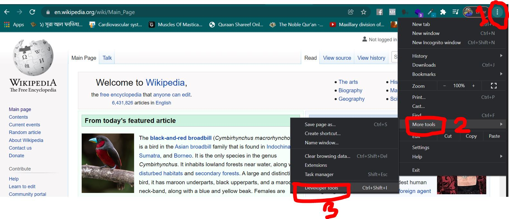

ছবিতে দেখাতে ধাপ অনুসরন করে এটা open করা যায়। এছাড়াও কিবোর্ডের 
* Ctrl + Shift + I 
press করেও এটি open করা যায়। 

এরপর আমরা নিচের মত একটি সেকশন দেখতে পাবো । 

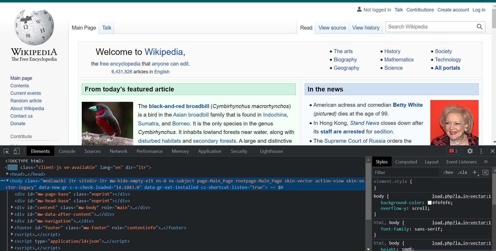

আমরা যদি ভালোভাবে খেয়াল করে দেখি তাহলে দেখবো এখানকার সব eliment rectangle এর মধ্যে আছে। 

#
### এখন আমরা কোনো একটা ওয়েবসাইটের tree stucture  দেখবো। 

[Click this link in a new tab and inspect ](https://tirahman105.github.io/tahins_kitchen/)

এখানে inspect করলে আমরা এমন অংশ দেখবো। এখানে বিভিন্ন অংশ দেখা যাচ্ছে যেখানে ধাপে ধাপে পরের অংশে যাচ্ছে। 


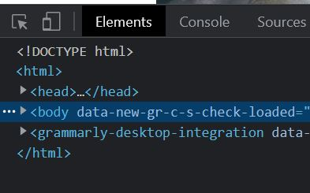

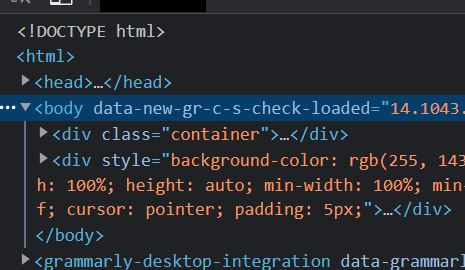

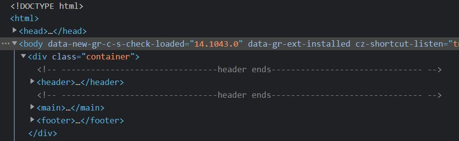

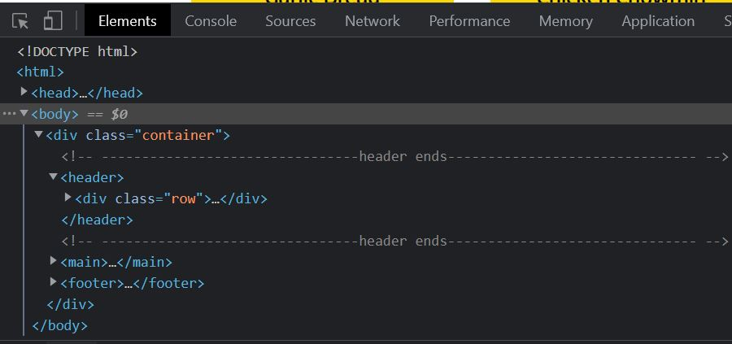


#
#
##  HTLM, CSS , DOM 

#

## HTML
#
### HTML web এর একটি language. এর স্পেসিফিক একটা  syntax ও rules আছে।

HTML এর বেসিক ওয়ার্ড হলো tag. Browser HTML tag কে eliment এ পরিনত করে যেটা tree তৈরি করে। 

It know how to do that because of the DOM. DOM (Document Object Module) is a standard convension for representing and interacting with eliments in HTML. 

আমরা developer tool এ যে tree দেখেছি সেটা আসলে DOM tree. Browser HTML document থেকে।  এই DOM tree তৈরি করে।

প্রতিটা HTML tag DOM এ একটা eliment তৈরি করে যার মাধ্যমে browser page কে display করে। 
#
* Element কীভাবে তৈরি হয়?

* Element শুরু হয় starting tag দিয়ে ও শেষ হয় ending tag দিয়ে। এর মাঝে যা থাকে সব কিছুই content. এটা হতে পারে empty, text বা অন্য কোনো element. 

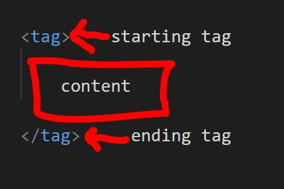
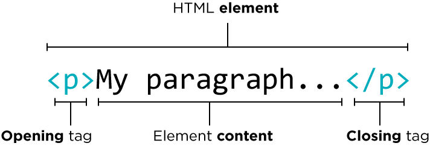


প্রতিটা tag এর একটা name or type আছে যেটার মাধ্যমে বোঝা যায় কি ধরনের element তৈরি হবে। 

যেমনঃ paragraph এর জন্য p tag, image এর জন্য img tag ইত্যাদি। 

কোনো tag এর attribute ও value থাকতে পারে। যেমনঃ 


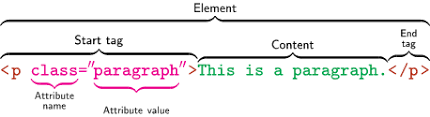


* HTML element সম্পর্কে আরো জানতে আমরা 
[এই লিংকে ](https://developer.mozilla.org/en-US/docs/Web/HTML/Element) দেখতে পারি। 

# 
#
# # CSS 
# 
CSS এর পুর্ণ রুপ Cascading Style Sheets।

কোনো element দেখতে কেমন হবে সেটার জন্য আমরা css ব্যবহার করি। 
যেমনঃ font এর size, color, background, border, position etc. 

#
## Everything is Box.

আমরা কোনো Webpage কে inspect করলে দেখতে পারবো সবকিছুই আসলে একটা বক্সের মধ্যে আছে। এমনকি element টা যদি circle কিছুও হয় সেটা একটা বক্সের মত জায়গা নিয়েছে। 

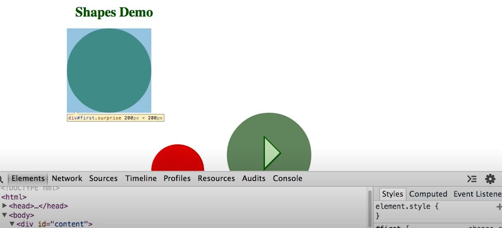

Webpage এ আমরা যা দেখি সবকিছুই কোনো বক্সে আছে। html এ box এর জন্য আমরা div tag use করি। 

নিচের ছবিতে এ সম্পর্কে একটা ধারনা দেয়া হয়েছে। 

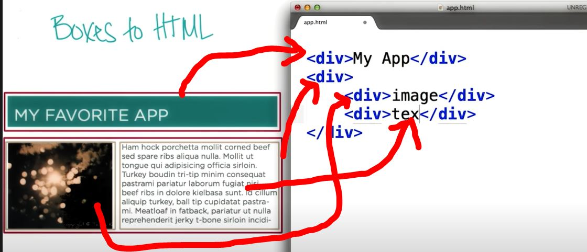

# 
এই বক্সকে style করার জন্য class attribute ইউজ করা হয় এবং প্রতিটা div কে আলাদা আলাদা class name দেয়া হয়। 

css দিয়ে ডিজাইন করার জন্য প্রথমে সিলেক্টর উল্লেখ করতে হয় তারপর property ও value দিতে হবে। 
নিচের ছবিতে h1 tag কে সিলেক্টর করা হয়েছে। color ও font size হলো property যাদের value দেয়া আছে। 
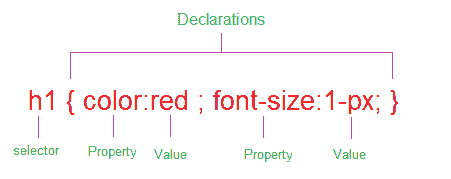

[See more about css](https://developer.mozilla.org/en-US/docs/Web/CSS/Reference)

#

### কিভাবে দুটো বক্সকে পাশাপাশি ডিস্প্লে করা হয়? 
```css
 display : flex;
 ```

 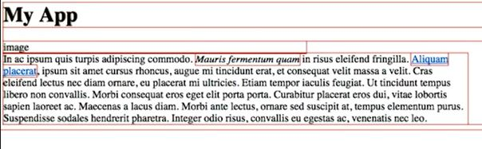

 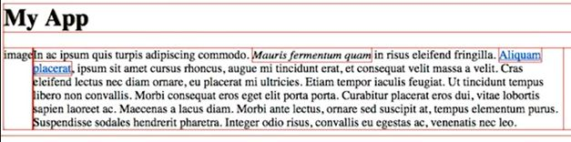

আমরা developer tool এর সাহায্যে চাইলে css style change করে দেখতে পারি। 

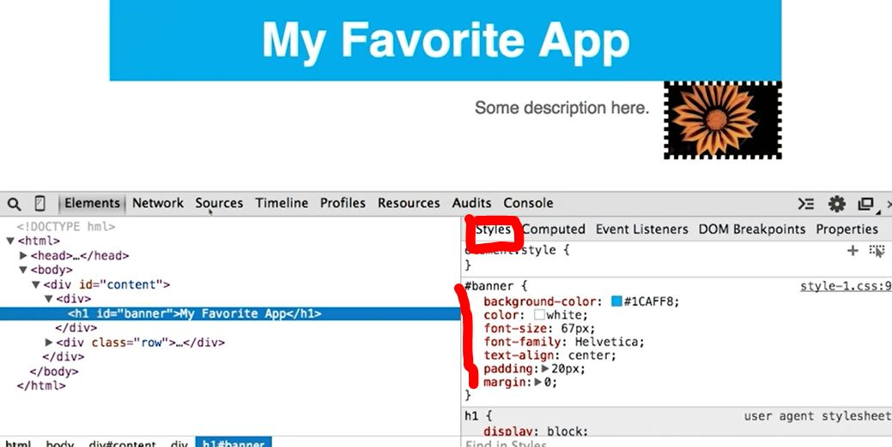

#
## Validating and Verifying HTML and CSS

[validator.w3.org](https://validator.w3.org/) 

### আমরা [এই website](https://validator.w3.org/) থেকে আমাদের html, css validation করতে পারি। আমাদের কোডে কোনো ভুল থাকলে সেটা দেখা যাবে। 


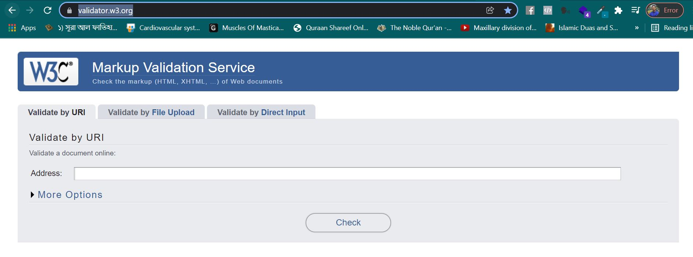
#
### css grid system

grid system এ সম্পূর্ন row কে ১২টা column এ ভাগ করা হয়। 

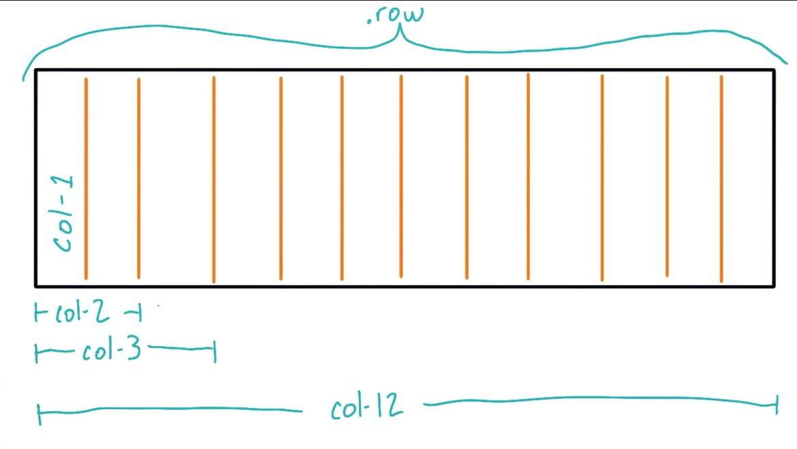

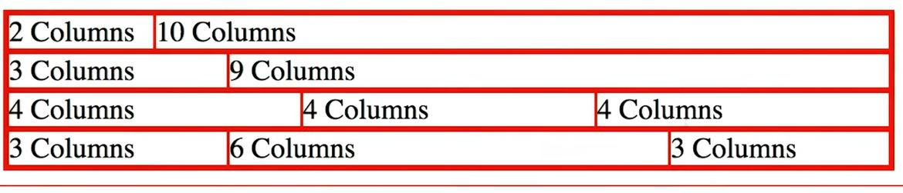

#
Margin , padding 

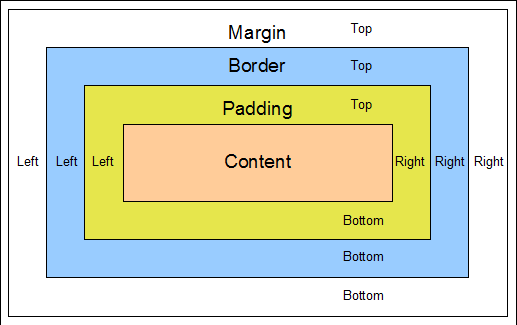
#
## Media Query 
#

Media query এর মাধ্যমে responsive design করা যায়। 

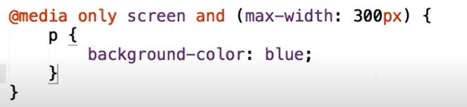

উপরের কোডে আমরা দেখতে পাচ্ছি max-width: 300px লেখা। এখানে p এর ব্যাকগ্রাউন্ড কালার blue. 

যখন 300 px এর নিচে স্ক্রিন সাইজ থাকবে তখন background color blue হবে। 

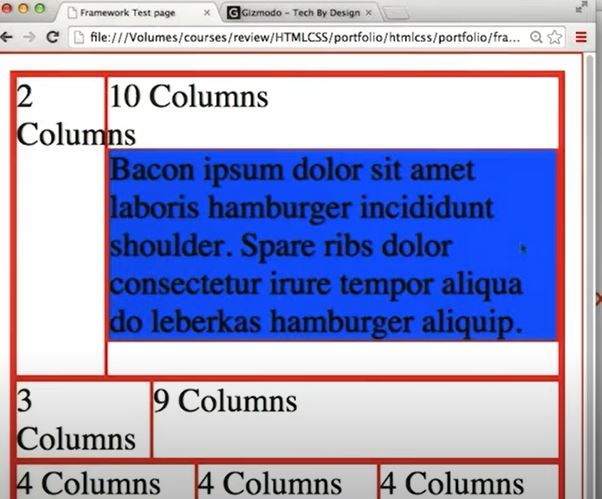
#
### Normalize CSS
??

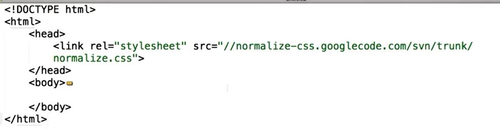


# 
## How to use google font ??
আমরা google font থেকে যেকোনো ফন্ট ব্যবহার করতে পারি। 

[https://fonts.google.com/](https://fonts.google.com/)

গুগল ফন্টের ওয়েবসাইট থেকে পছন্দের ফন্ট সিলেক্ট করে সেই লিংক html এর head tag এর ভিতর add করে দিতে হয় ও css file এ সেটা mention করে দিতে হয়। 

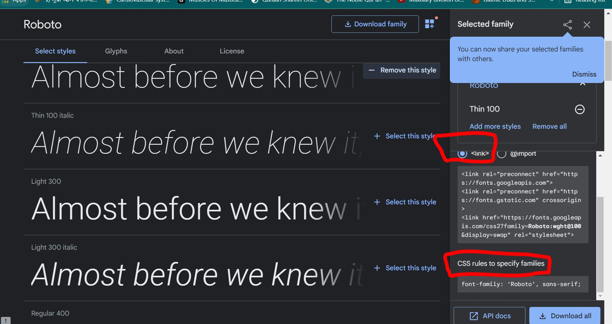

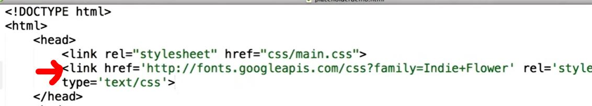

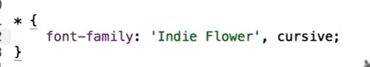


#
# Bootstrap

### Website : [https://getbootstrap.com/](https://getbootstrap.com/)

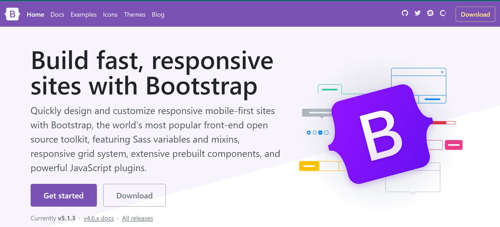

Bootstrap একটি framework যার সাহায্যে খুব সহজেই ওয়েবপেজ তৈরি করা যায়। 

Bootstrap এর grid system টা বোঝা জরুরী। 

Grid system
* Bootstrap includes a responsive, mobile first fluid grid system that appropriately scales up to 12 columns as the device or viewport size increases. 
* It includes predefined classes for easy layout options

For Details documentation 
[see here](https://getbootstrap.com/docs/3.4/css/)
HTML, CSS ও Bootstrap use করে আমি কিছু ডিজাইন করেছি। 
* [Portfolio](https://tirahman105.github.io/frontend_p1/)
* [The Band](https://tirahman105.github.io/the_band/)
 * [Biology](https://tirahman105.github.io/biology/)

 * [Utopic Flower](https://tirahman105.github.io/basic_template_practice)

 * [BR Architech](https://tirahman105.github.io/BR_architects/)

 * [Tahin's Kitchen](https://tirahman105.github.io/tahins_kitchen/)


